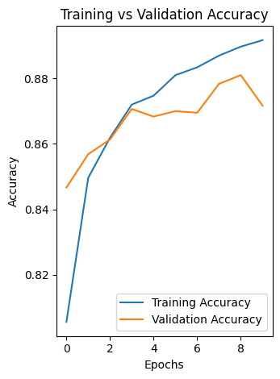
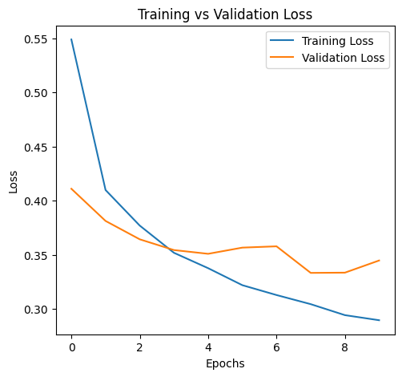
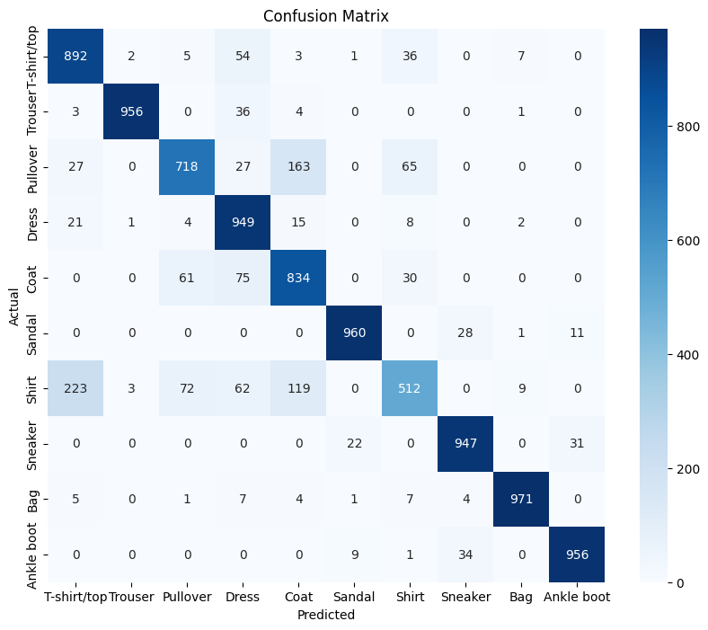

# Fashion MNIST Classification Project

## Problem Description

This project uses Deep Learning and Neural Networks to classify clothing images from the Fashion MNIST dataset.

The model is built using TensorFlow/Keras and trained on grayscale clothing images of size 28x28 pixels.

The goal is to correctly classify fashion items into 10 categories.

Classes include:

- T-shirt/top
- Trouser
- Pullover
- Dress
- Coat
- Sandal
- Shirt
- Sneaker
- Bag
- Ankle boot

---

## Dataset Link

Fashion MNIST Dataset:

https://github.com/zalandoresearch/fashion-mnist

---

## Technologies Used

- Python
- TensorFlow
- Keras
- NumPy
- Matplotlib
- Scikit-learn
- Seaborn

---

## Model Architecture

The neural network contains:

- Flatten Layer
- Dense Layer (128 neurons, ReLU)
- Dropout Layer
- Dense Layer (64 neurons, ReLU)
- Output Layer (Softmax)

Optimizer:
- Adam

Loss Function:
- Sparse Categorical Crossentropy

---

## Experiments

Three experiments were performed:

| Experiment | Description |
|---|---|
| Baseline Model | ReLU activation with default Adam optimizer |
| Experiment 1 | Sigmoid activation function |
| Experiment 2 | Higher learning rate with Early Stopping |

---

## Results

| Model | Test Accuracy | Test Loss |
|---|---|---|
| Baseline (ReLU, lr=0.001) | 0.89 | 0.30 |
| Exp1 (Sigmoid, lr=0.001) | 0.87 | 0.36 |
| Exp2 (ReLU, lr=0.01) | 0.90 | 0.28 |

---
## Accuracy Plot



## Loss Plot



## Confusion Matrix



## Instructions for Running the Project

### 1. Clone Repository

```bash
git clone https://github.com/aishaamahran/fashion-mnist-classification.git
```

### 2. Install Requirements

```bash
pip install -r requirements.txt
```

### 3. Run the Notebook

Open:

```text
Fashion_MNIST_Project.ipynb
```

Run all cells.

---

## Saved Model

The trained model is saved as:

```text
fashion_mnist_mlp_model.h5
```

---

## Author

Aishamahran

GitHub:
https://github.com/aishaamahran